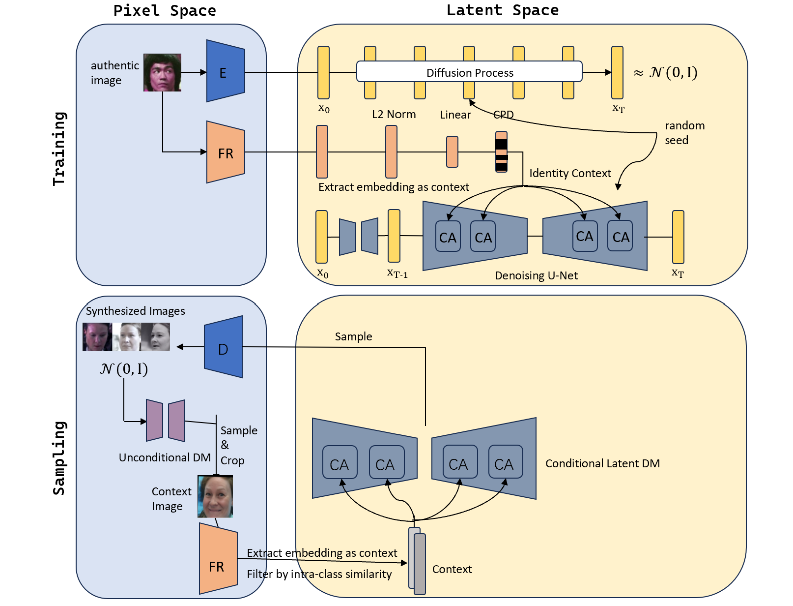

# IDiff-Face Reproduce
I reproduced IDiff-Face as a course assignment,the code of which is based on [IDiff-Face](https://github.com/fdbtrs/IDiff-Face) and [CVPR_FRCSyn_ADMIS](https://github.com/zzzweakman/CVPR24_FRCSyn_ADMIS).I express my heartfelt thanks to them!
## Pipeline
I use a latent diffusion model (LDM) based on [IDiff-Face](https://github.com/fdbtrs/IDiff-Face) to synthesize faces. The LDM is conditioned using identity embeddings as contexts, extracted from faces by a pretrained [ElasticFace](https://github.com/fdbtrs/ElasticFace) recognition model.


## Dataset and pretrained models
I use the CASIA-WebFace dataset to train an IDiff-Face diffusion model and train the recognition model based on [TFace](https://github.com/Tencent/TFace).

The evaluation results of pretrained face recognition models on widely used benchmark:

|    Backbone    |      Head      |       Dataset      |   Id   |  LFW  | CFP-FP | CPLFW | AGEDB | CALFW | Average |
| :------------: | :------------: | :----------------: | :----: | :---: | :----: | :---: | :---: | :---: | :----:  |
|      IR-50     |    ArcFace     |    CASIA_WebFace   | 10.5K  | 99.40 | 96.91  | 89.72 | 94.77 | 93.40 |  94.84  |
|      IR-50     |    ArcFace     |     IDiff-Face     |  10K   | 97.10 | 82.00  | 76.65 | 78.40 | 86.32 |  84.09  |
|      IR-50     |    ArcFace     |        DCFace      |  10K   | 98.60 | 88.21  | 83.33 | 88.18 | 91.38 |  89.94  |
|      IR-50     |    ArcFace     |        Syn_10k     |  10K   | 99.07 | 92.87  | 88.15 | 88.67 | 91.02 |  91.96  |


## Usage
The experiment can mainly be divided into **identity conditioned LDM training**, **context sampling**, and **recognition model training**. Specifically, **identity conditioned LDM training** and **context sampling** are implemented based on the [IDiff-Face repository](https://github.com/fdbtrs/IDiff-Face).  The implementation of **recognition model training** is fundamentally based on [TFace repository](https://github.com/Tencent/TFace).

### 1. Identity conditioned LDM training
* **Install environment:** Please refer to ['How to use the code'](https://github.com/fdbtrs/IDiff-Face?tab=readme-ov-file#how-to-use-the-code) to set up the environment. 

* **Download the data and pretrained models required for training LDM:** The training **embeddings** used as contexts during training and their corresponding **images** have to be downloaded from the [link](https://drive.google.com/drive/folders/1OR93oblKiD4UvUTwZUHjvW80FeXHHnXz?usp=sharing) and placed under `dataset/CASIA`. 
The [pre-trained autoencoder](https://drive.google.com/drive/folders/1jEgr60OAR6hjbaF651723IBYG_DF0kGf?usp=drive_link) for the latent diffusion training is obtained from the pre-trained `fhq256` LDM from [Rombach et al.](https://github.com/CompVis/latent-diffusion/blob/main/models/ldm/ffhq256/config.yaml) please follow their license distribution. For training, make sure the tree of the directory is as follows:
  ```
    IDiff-Face Reproduce
    ├── dataset
    │   ├── CASIA
    │   │   ├── elasticface_embeddings # context file and image index file
    │   │   ├── CASIA_namelist.txt # for training
    │   │   └── images # decompressed CASIA-WebFace images
    │   ...
    ├── generative_model_training
    │   ├── ckpt
    │   │   ├── autoencoder
    │   │   │   ├── first_stage_decoder_state_dict.pt # for training
    │   │   │   └── first_stage_encoder_state_dict.pt # for training
    │   │   ...
    │   ...
    ...
    ```
* **Start training:**
It has to be ensured that the `dataset: CASIA_file` option is set and that the paths in the corresponding subconfiguration `generative_model_training/configs/dataset/CASIA_file.yaml` are pointing to the training images and pre-extracted embeddings. The model training can be initiated by executing:
 ```
 cd generative_model_training
 python main.py
 ```

### 2. Context enhanced sampling
We employ another unconditional DDPM, pretrained on the FFHQ dataset, to help generate high-quality contexts. 
* **Prepare contexts:**
To facilitate ease of use, I directly use the pre-generated context faces along with the context embeddings processed via the [Elasticface](https://github.com/fdbtrs/ElasticFace) model supplied by [CVPR_FRCSyn_ADMIS](https://github.com/zzzweakman/CVPR24_FRCSyn_ADMIS) . Please download them from this [link](https://drive.google.com/drive/folders/1fss6Y6d25lzxaUXT2YgdxezgXUJkm4Zp?usp=sharing) and place them in `dataset/context_database`. For sampling, make sure the tree of the directory is as follows:
  ```
    IDiff-Face Reproduce
    ├── dataset
    │   ├── context_database
    │   │   ├── elasticface_embeddings # context file 
    │   │   └── images # decompressed context faces images
    │   ...
    ...
    ```
* **Run sampling script:**
The sampling process can be initiated by executing:
  ```
  cd generative_model_training
  python sample.py
  ```

### 3. Recognition model training


* **Prepare TFR format data:**
  To convert raw image to tfrecords, generate a new data dir including some tfrecord files and a index_map file, please run:
  ``` bash
  cd recognition_model_training
  python3 tools/img2tfrecord.py --img_list YOUR_IMAGE_ROOT --tfrecords_dir SAVE_ROOT --tfrecords_name SAVE_NAME
  ```


*  **Train:**
  Modified the `DATA_ROOT` and `INDEX_ROOT` in `train.yaml`, `DATA_ROOT` is the parent dir for tfrecord dir,  `INDEX_ROOT` is the parent dir for index file.
    ```bash
    cd recognition_model_training
    bash local_train.sh
    ```

* **Test:**
  Detail implementations and steps see [Test](https://github.com/Tencent/TFace/tree/master/recognition/test) in [TFace](https://github.com/Tencent/TFace) repository. 


## Acknowledgement
This repo is modified and adapted on these great repositories, we thank these authors a lot for their great efforts.
* [IDiff-Face](https://github.com/fdbtrs/IDiff-Face)
* [CVPR_FRCSyn_ADMIS](https://github.com/zzzweakman/CVPR24_FRCSyn_ADMIS)
* [TFace](https://github.com/Tencent/TFace)
* [DCFace](https://github.com/mk-minchul/dcface)
